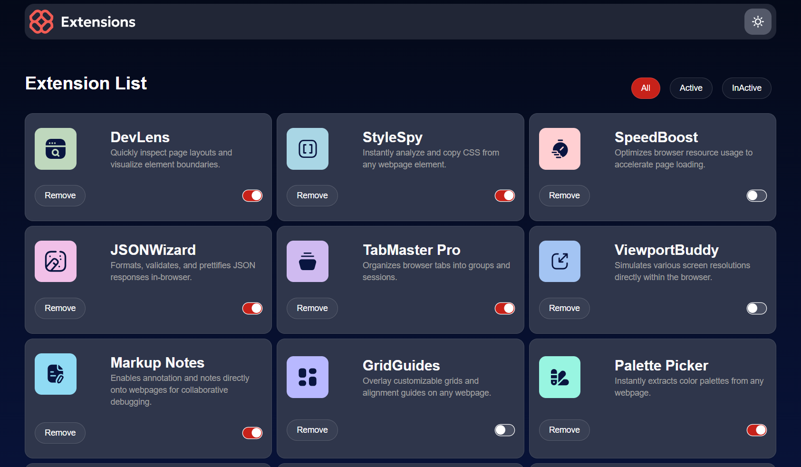

# 📦 Extension Manager

A simple, interactive web app for managing browser-like extensions.  
Users can enable/disable, remove, and restore extensions with a clean UI, toasts, and animations.

---

## 🚀 Features

- ✅ View all installed extensions  
- ✅ Remove extensions (with confirmation modal)  
- ✅ Restore removed extensions  
- ✅ Animated loader when restoring (“installing” effect)  
- ✅ Toast notifications for feedback  
- ✅ Smooth animations with Framer Motion  
- ✅ Counters for active/removed extensions  

---

## 🖼️ Preview



---

## 🛠️ Tech Stack

- **React + TypeScript**  
- **Tailwind CSS** (styling)  
- **Framer Motion** (animations)  
- **Ui shadcn** (for pre built components)

---

## ⚡ Getting Started

Clone the repo and run locally:

```bash
git clone https://github.com/Mr-Azeez/browser-extension-manager.git
cd extension-manager
npm install
npm run dev
